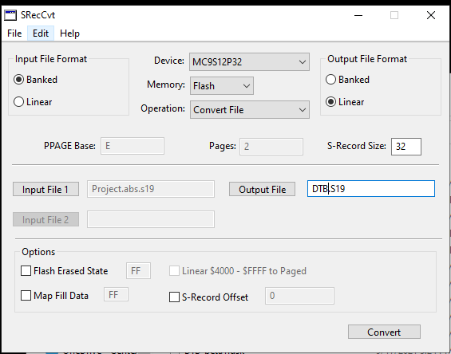

# S12VR32_Bootloader
## Creating a bootable srec.
The .s19 must be converted using NXP's converter tool **SRecCvt-GUI.exe**.

Additional information is found in the [AN4258.pdf](Assets/AN4258.pdf) application note in the Assets directory.

## Bootloading applications
Ensure the address-range of the application to boot doesn't overlap with the bootloader.
Bootloader address-range = 0x0003_F000-0x0003_FF08

### Application reset and interrupt vector table addressing
These should be placed at 0x0003_EFxx instead of 0x0003_FFxx.